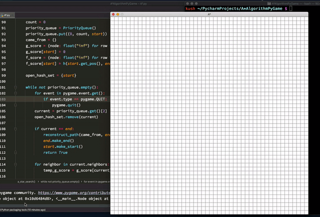

# AStarAlgorithmVisual
Visualization of the A star algorithm – an informed path finding algorithm which uses a heruistic to find the shortest path most efficiently – an improved version of Dijkstra's in terms of time complexity.

